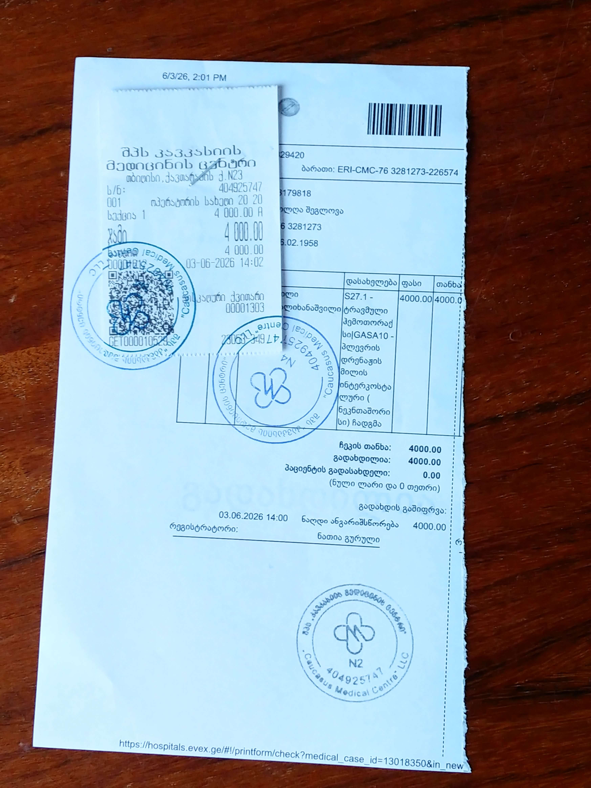

# BRUTAL ASSAULT: URGENT APPEAL FOR HELP
The victim: Shcheglova Olga

I am a 68-year-old independent writer currently living in Georgia, Tbilisi.
Recently I was attacked, brutally
beaten up and tortured by two strong and extremely cruel men. 

During the assault I was also robbed — I lost all my personal belongings including two smartphones, all my money, and international passport. 

I was badly injured: at least 5 broken ribs, hemathorax, pneumothorax, eardrum perforation, multiple contusions and hematomas on the head (see Appendix 3).

Tbilisi police opened a criminal case 007280526001(see Appendix 1, 2).
I was urgently hospitalized for surgery.
The treatment alone so far cost me 4359 GEL (see Appendix 4).

I need money for further treatment and rehabilitation, which is slow at my age,  and basic living expenses.

All the documentation (medical, legal, and financial) can be found in the Appendix below. 

*The attackers videotaped the execution themselves. Police found it in their phones*.

**A SHORT FRAGMENT OF THIS VIDEO IS AVAILABLE HERE:**

https://vimeo.com/1204855777

https://rumble.com/v7bux9g-brutal-assault-on-a-68-year-old-writer-in-georgia.html

## DONATIONS

If you want to help, here is my wallet:

0x55D4819973eC8573dD2E4f709E366363804E1F18

Network: **Polygon** (the only option!!!)

**Currency**:

**USDT (Polygon)**

**USDC (Polygon)**

**MATIC / POL**

Any amount of money is very important and will be taken with gratitude; it goes directly on food, housing, clothes and medical help.

Thank you for your help!

### APPENDIX

1. Police Certificate asserting the fact of the assault.

2. The prosecutor's statement.

3. Medical documentation from the Caucasus medical Center, Tbilisi.

a) Epicris

b) Form IV-100a (general)

c) Form IV-100a (eardrum)

4. Treatment expenses

